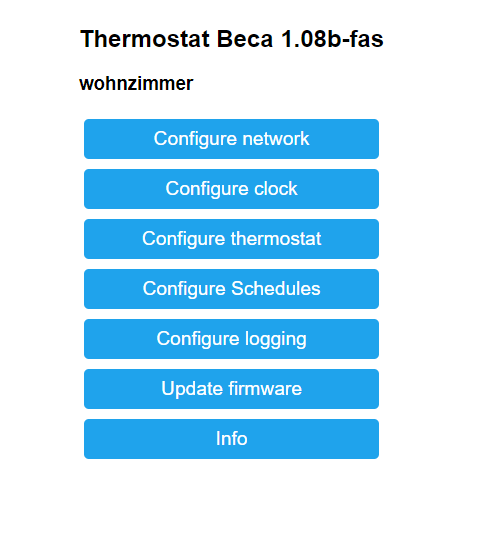
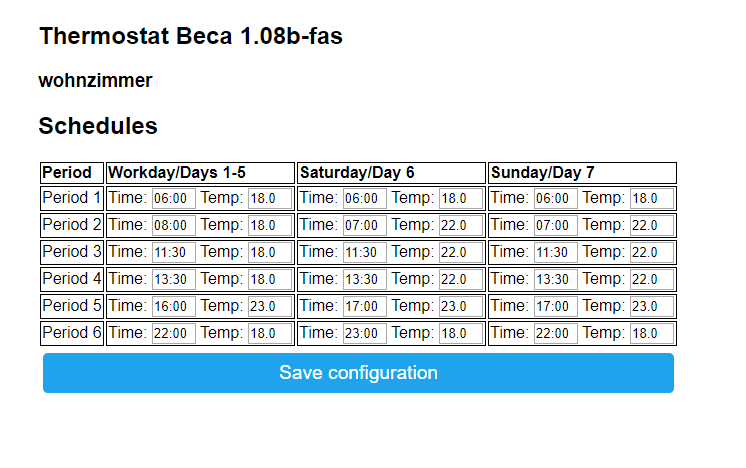
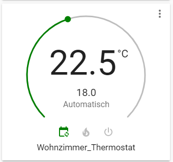
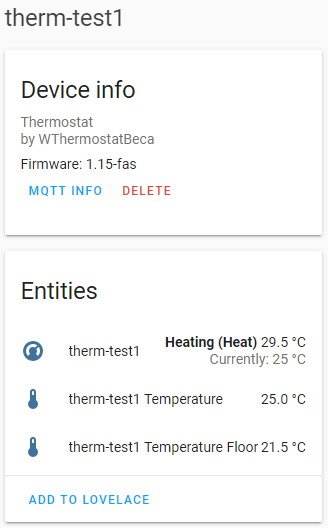

# ThermostatBecaWifi

Fork of https://github.com/klausahrenberg/WThermostatBeca with some new features

Replaces original Tuya firmware on Beca thermostat with ESP8266 wifi module. The firmware is tested with following devices:
* BHT-002-GBLW, BHT-6000 (floor heating)
* BHT-002-GALW (Water/Gas heating)
* BHT-002-GCLW (Water/Gas Boiler)
* BAC-002-ALW (heater, cooling, ventilation)

Also selled by Moes or Qiumi.

  

## Features
* No Cloud dependencies!
* Enables thermostat to communicate via MQTT and/or Mozilla WebThings
* Autodiscovery for Home Assistant via MQTT _(fas)_
* Autodiscovery for WebThings via mDNS
* Configuration of connection, device parameters and schedules via web interface
* Provides NTP, time zone handling and Daylight-Saving-Calculation _(fas)_ to set the clock of thermostat
* Provides Fallback to Access Point mode if requested using panel-buttons _(fas)_
* Reading and setting of all parameters via MQTT
* Reading and setting of main parameters via WebThings
* Only BHT-002-GxLW: actualFloorTemperature (external temperature sensor)
* Only BAC-002-ALW: fanSpeed:auto|low|medium|high; systemMode:cooling|heating|ventilation
* Reading and setting of time schedules via MQTT
* Reading and setting of Schedules via Web-GUI _(fas)_
* Logging to MQTT _(fas)_

_(fas)_: Only available in -fas version

## Hardware
The Hardware itself has two Microcontrollers:
* The MCU, the Main Controlling Unit.
  * It controls the Display, the Relais, has RTC, etc.
  * The software on the MCU is not upgraded, so no changes here.
* The ESP8266-based Tuya-Wifi-Module. 
  * WThermostat replaces the Software on this ESP-Module
  * There is a serial connection between MCU and ESP. Via this connection the we can control the MCU
  * Only the Wifi-Verisons of thermostats have the ESP-Module.

### Hardware-Versions
You need the WiFi Version! (W in productname suffix, like -GALW). There is also a version without WLAN.

The BHT Version is for heating only. The BAC-Version has modes Cooling, Heating and Ventilation.
The HBT-002-GA/GB/GC versions only differs in relais-wiring. 

* GA - Water-Heating
  * Two Relais for opening and closing valve
  * Only one Relais will be closed at the same time
  * Closing Relais PIN 1 - PIN 3 (N or L)
  * Opening Relais PIN 2 - PIN 3 (N or L)
  * Product Spec says Max Power: 3 A
* GB - Electric-Heating
  * Connect Heating between PIN 1 and PIN 2
  * Product Spec says Max Power: 16 A
* GC - Water/Gas Boiler
  * One Relais - potential free
  * Relaise on PIN 1 - PIN 2 (dry contacts)
  * Product Spec says Max Power: 3 A

## Download binaries
Pre-built binaries can be downloaded at <a href="https://github.com/fashberg/WThermostatBeca/releases">releases-page</a>.

## Hardware Installation
 * see <a href="Installation.md">Installation.md</a>

## Software Installation
You can install the firmware either
* by using tuya-convert - no Hardware Modifications necessary
* by soldering cables to the ESP-Modules using an ESP/Arduino-Programmer (3,3 Volt TTL)

Follow instructions here: <a href="Flashing.md">Flashing.md</a>

## Initial configuration
To setup the device model, network options and other parameters, follow instrcution here:  
Configuration.md  
After initial setup, the device configuration is available via `http://<device_ip>/` 

## Upgrading
You can Upgrade over the Air from other versions of ThermostatBecaWifi on the Web-GUI.
Please check all settings after Upgrade!

If you upgrade from original Klaus-Ahrenberg's Original-Version please note:
* Only WLAN settings are kept
* If you get "Not Enough Space" you can use WThermostat_1.xx-fas-minial.bin as interim-version.
  * WLAN settings are kept
  * no MQTT, no Beca-control, no Clock in -minimal
  * Then Upgrade to normal-version
  * Not neccessary when upgrading from fas to fas versions

## Screenshots
Main Screen:
  
Network Screen:
  
Schedule Screen:
  

# Integration in WebThings
Since version 0.96 this firmware supports Mozilla WebThings directly. With webthings you can control the thermostat via the Gateway - inside and also outside of your home network. No clunky VPN, dynDNS solutions needed to access your home devices. I recommend to run the gateway in parallel to an MQTT server and for example Node-Red. Via MQTT you can control the thermostat completely and logic can be done by Node-Red. WebThings is used for outside control of main parameters.  
Add the device to the gateway via '+' icon. After that you have the new nice and shiny icon in the dashboard:  
  
The icon shows the actual temperature and heating state.  
There is also a detailed view available:  


# Integration in Home Assisant
    
ThermostatBecaWifi supports optional HASS-Autodiscovery since Version 1.08-fas (currently only for heating devices).
You have to enable it at Thermostate (settings network) and of course it must be enabled in your HASS configuration.yaml file:
```yaml
mqtt:
  broker: <ip of broker>
  discovery: true
  discovery_prefix: homeassistant
```

For manual Configuration here is an example for your configuration.yaml file:
```yaml
climate:
  - platform: mqtt
    name: Room_Thermostat
    action_topic: "home/room/stat/things/thermostat/properties"
    action_template: "{{value_json.action}}"
    temperature_command_topic: "home/room/cmnd/things/thermostat/properties/targetTemperature"
    temperature_state_topic: "home/room/stat/things/thermostat/properties"
    temperature_state_template: "{{value_json.targetTemperature}}"
    current_temperature_topic: "home/room/stat/things/thermostat/properties"
    current_temperature_template: "value_json.temperature}}"
    away_mode_command_topic: "home/room/cmnd/things/thermostat/properties/ecoMode"
    away_mode_state_topic: "home/room/stat/things/thermostat/properties"
    away_mode_state_template: "{{value_json.ecoMode}}"
    mode_command_topic: "home/room/cmnd/things/thermostat/properties/mode"
    mode_state_topic: "home/room/stat/things/thermostat/properties"
    mode_state_template: "{{value_json.mode}}"
    payload_on: "true"
    payload_off: "false"
    modes: [ "heat", "auto", "off" ]
    min_temp: 5
    max_temp: 35
    temp_step: 0.5
    precision: 0.5
```
If you have several thermostates you can anchor some settings while defining the first device and refer later on. Example: 
```yaml
climate:
- platform: mqtt
  name: Wohnzimmer_Thermostat
  action_topic: "home/wohnzimmer/stat/things/thermostat/properties"
  temperature_command_topic: "home/wohnzimmer/cmnd/things/thermostat/properties/targetTemperature"
  temperature_state_topic: "home/wohnzimmer/stat/things/thermostat/properties"
  current_temperature_topic: "home/wohnzimmer/stat/things/thermostat/properties"
  away_mode_command_topic: "home/wohnzimmer/cmnd/things/thermostat/properties/ecoMode"
  away_mode_state_topic: "home/wohnzimmer/stat/things/thermostat/properties"
  mode_command_topic: "home/wohnzimmer/cmnd/things/thermostat/properties/mode"
  mode_state_topic: "home/wohnzimmer/stat/things/thermostat/properties"
  <<: &commonbeca
    action_template: "{{value_json.action}}"
    temperature_state_template: "{{value_json.targetTemperature}}"
    current_temperature_template: "{{value_json.temperature}}"
    mode_state_template: "{{value_json.mode}}"
    away_mode_state_template: "{{value_json.ecoMode}}"
    payload_on: "true"
    payload_off: "false"
    modes: [ "heat", "auto", "off" ]
    min_temp: 5
    max_temp: 35
    temp_step: 0.5
    precision: 0.5
- platform: mqtt
  name: Flur_Thermostat
  action_topic: "home/flur/stat/things/thermostat/properties"
  temperature_command_topic: "home/flur/cmnd/things/thermostat/properties/targetTemperature"
  temperature_state_topic: "home/flur/stat/things/thermostat/properties"
  current_temperature_topic: "home/flur/stat/things/thermostat/properties"
  away_mode_command_topic: "home/flur/cmnd/things/thermostat/properties/ecoMode"
  away_mode_state_topic: "home/flur/stat/things/thermostat/properties"
  mode_command_topic: "home/flur/cmnd/things/thermostat/properties/mode"
  mode_state_topic: "home/flur/stat/things/thermostat/properties"
  <<: *commonbeca
- platform: mqtt
  name: WC_Thermostat
  action_topic: "home/wc/stat/things/thermostat/properties"
  temperature_command_topic: "home/wc/cmnd/things/thermostat/properties/targetTemperature"
  temperature_state_topic: "home/wc/stat/things/thermostat/properties"
  current_temperature_topic: "home/wc/stat/things/thermostat/properties"
  away_mode_command_topic: "home/wc/cmnd/things/thermostat/properties/ecoMode"
  away_mode_state_topic: "home/wc/stat/things/thermostat/properties"
  mode_command_topic: "home/wc/cmnd/things/thermostat/properties/mode"
  mode_state_topic: "home/wc/stat/things/thermostat/properties"
  <<: *commonbeca
```
See  https://www.home-assistant.io/integrations/climate.mqtt/ for more information.

# Device-Functions
## Json structures
The software provides different messages:
1. Thermostat State report (JSON)
2. Schedules (JSON)
3. Device (at start of device to let you know the topics and ip)
4. Logs (Plain)

### 1. Thermostat State report 
**MQTT:** State report is provided every 5 minutes, at change of a parameter or at request via message with empty payload to `<your_topic>/cmnd/things/thermostat/properties` , reports are sent to `<your_topic>/stat/things/thermostat/properties`.
The state report is sent with MQTT-retain-flag enabled.

**WebThings:** State report can be requested by: `http://<device_ip>/things/thermostat/properties`  

```json
{
  "idx":"thermostat_beca",
  "ip":"192.168.0.xxx",
  "firmware":"x.xx",
  "temperature":21.5,
  "targetTemperature":23,
  "deviceOn":true,
  "schedulesMode":"off|auto",
  "ecoMode":false,
  "locked":false,
  "state":"off|heating", //only_available, if hardware is modified
  "floorTemperature":20, //only_BHT-002-GBLW
  "fanMode":"auto|low|medium|high", //only_BAC-002-ALW
  "systemMode":"cool|heat|fan_only", //only_BAC-002-ALW
  "mode":"off|auto|heat" // BHT-002: combined Mode for better home assistant support. 
  "mode":"off|autoheat|autocool|autofan|heat|cool|fan_only" // BAC-002-ALW
  "action":"off|idle|heating|cooling|fan" // read only current action, idle only available if hardware is modified, cooling/fan only BAC-002
}
```


### 2. Schedules
**MQTT:** Request actual schedules via message with empty payload to `<your_topic>/cmnd/things/thermostat/schedules`, answers are reported to to `<your_topic>/stat/things/thermostat/schedules`

**WebThings:** State report can be requested by: `http://<device_ip>/things/thermostat/schedules`

```json
{
  "w1h":"06:00",
  "w1t":20,
  "w2h":"08:00",
  "w2t":15,
  ...
  "w6h":"22:00",
  "w6t":15,
  "a1h":"06:00",
  ...
  "a6t":15,
  "u1h":"06:00",
  ...
  "u6t":15
}
```
### 3. Device Report
**MQTT:** At start of device to let you know the topics and ip to `devices/thermostat`  

**WebThings:** n.a.

```json
{
  "url":"http://192.168.0.xxx/things/thermostat",
  "ip":"192.168.0.xxx",
  "topic":"thermostat_beca/things/thermostat"
}
```

### 4. Logs
If logging is enabled (webgui/mqtt) you will see messages like:
```
home/<your_topic>/tele/log trace: sending heartBeatCommand
home/<your_topic>/tele/log trace: commandCharsToSerial: 55 aa 00 00 00 00
```

## Modifying parameters via MQTT
Send a json with changed parameters to `<your_topic>/cmnd/things/thermostat/properties`.  
Send a json with changed schedules to `<your_topic>/cmnd/things/thermostat/schedules`.
Also you can change single values by sending the value to `<your_topic>/cmnd/things/thermostat/properties/parameterName`.

Examples:
```
# set device on
mosquitto_pub -h mqtt -t home/test/cmnd/things/thermostat/properties/deviceOn  -m "true"

# set device to heating
mosquitto_pub -h mqtt -t home/test/cmnd/things/thermostat/properties/mode  -m "heat"

# set target temperature
mosquitto_pub -h mqtt -t home/test/cmnd/things/thermostat/properties/targetTemperature  -m "23.5"

# set target temperature (json)
mosquitto_pub -h mqtt -t home/test/cmnd/things/thermostat/properties -m '{"targetTemperature":23.00}'

# set target temperature and mode (json)
mosquitto_pub -h mqtt -t home/test/cmnd/things/thermostat/properties -m '{"targetTemperature":22.00,"mode":heat}'

# set device to auto (target temperature controlled by MCU-Scheduler)
mosquitto_pub -h mqtt -t home/test/cmnd/things/thermostat/properties/mode -m "auto"

# just request properties
mosquitto_pub -h mqtt  -t home/test/cmnd/things/thermostat/properties -n

# request properties and show answer directly
mosquitto_rr -h mqtt -t home/test/cmnd/things/thermostat/properties  -n -e home/test/stat/things/thermostat/properties


# Change Schedules (here: weekday schedules)
mosquitto_pub -h mqtt -t home/test/cmnd/things/thermostat/schedules -m \
'{"w1h":"06:00","w1t":20.00,"w2h":"08:00","w2t":15.00,"w3h":"11:30","w3t":15.00,"w4h":"13:30","w4t":15.00,"w5h":"17:00","w5t":23.00,"w6h":"23:00","w6t":15.00}'

# disable MQTT logging
mosquitto_pub -h mqtt -t home/test/cmnd/things/logging/properties/logLevel -m "silent"

# set to level trace (available: silent|fatal|error|warning|notice|trace|verbose)
mosquitto_pub -h mqtt -t home/test/cmnd/things/logging/properties/logLevel -m "trace"

# show logs
mosquitto_sub -h mqtt -v -t "home/test/tele/log/#"

```

### Don't like or it doesn't work?
Flash the original firmware (see installation). Write me a message with your exact model and which parameter was not correct. Maybe your MQTT-server received some unknown messages - this would be also helpful for me. Again: I have tested this only with model BHT-002-GBLW. If you have another device, don't expect that this is working directly.

### Build this firmware from source
For build from sources i suggest <a href="https://code.visualstudio.com/">Visual Studio Code</a> and <a href="https://platformio.org/">Platform.IO</a>.
 All sources needed are inside the folder 'WThermostat', also you need the WAdapter library from https://github.com/fashberg/WAdapter.
 Additionally you will need some other libraries: DNSServer, EEPROM (for esp8266), ESP8266HTTPClient, ESP8266mDNS, ESP8266WebServer, ESP8266WiFi, Hash, NTPClient, Time.
